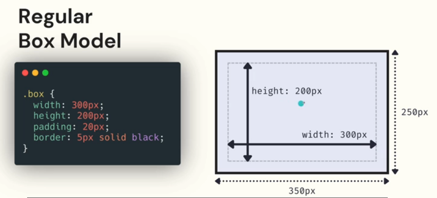

# Notes
## Box Model
https://developer.mozilla.org/ru/docs/Learn/CSS/Building_blocks/The_box_model

Блочная модель — это алгоритм расчёта размеров каждого отдельного элемента на странице, которым браузеры пользуются при отрисовке.
### Percentages
Размеры в % - обозначают процентный размер от родительского контейнера.
### Main Box Model Values
1. Border
2. Padding
3. Margin
4. Width/Height
## Alternate Box Model
`box-sizing: border-box` - width and height control the overall dimensions of the visible box.

Regular box sizing:



Alternate box sizing:


## Display property
https://developer.mozilla.org/en-US/docs/Web/CSS/display

The display CSS property sets whether an element is treated as a block or inline box and the layout used for its children, such as flow layout, grid or flex.

`Display: none` - используется для сокрытия элементов, зачастую при анимации/разных разрешениях.
`Display: inline-block/inline/block` - изменение вида элемента с inline на block и наоборот.
## Automargin
`margin: 0 auto` - centers text in the container
## Margin Collapsing
Margins top and bottom collapse, wins the biggest (-50 is bigger than -20). Margins left and right don't collapse.
## Max and min width
```
width: 50%;
min-width: 200px;
max-width: 500px;
```
Контейнер сжимается до 50% в зависимости от размера контейнера (экрана). `min/max-width` устанавливает мин/макс ширину контейнера, после достижения которых контейнер не меняется.
## Box Shadow Generator
https://cssgenerator.org/box-shadow-css-generator.html
## Overflow
Устанавливает, что должно происходить, если содержимое выходит за пределы элемента.
