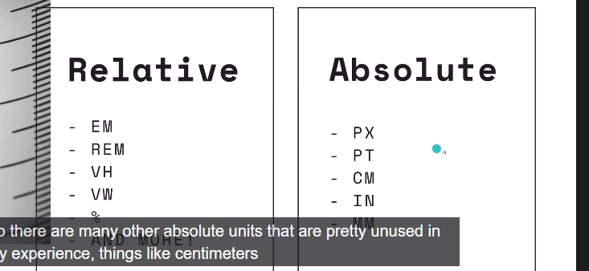

# Notes
## Relative and Absolute Units
CSS length - https://hacks.mozilla.org/2013/09/css-length-explained/

## CSS Values and Units
https://developer.mozilla.org/en-US/docs/Learn/CSS/Building_blocks/Values_and_units
## Float Property
https://developer.mozilla.org/en-US/docs/Web/CSS/float